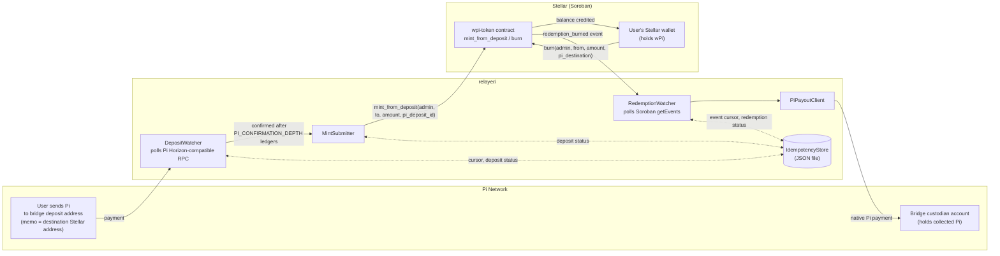

# wPi Relayer

The relayer bridges Pi Network deposits to minted wPi on Stellar (Soroban),
and watches wPi burns to release native Pi back to redeemers. It is the
missing piece referenced by
[Stellar-contracts-v1/README.md](../Stellar-contracts-v1/README.md): *"Wrapped
Pi minted by the relayer after Pi deposits are observed on Pi Network."*

## Architecture



**Deposit path**: `DepositWatcher` polls Pi Network for payments to the
bridge deposit address, tracks each until it clears the confirmation-depth
policy (below), then hands confirmed deposits to `MintSubmitter`, which
calls the contract's `mint_from_deposit` (added for this bridge — see
[Stellar-contracts-v1/wpi-token](../Stellar-contracts-v1/wpi-token/src/lib.rs)).

**Redemption path**: `RedemptionWatcher` polls the contract's
`redemption_burned` events (emitted by `burn`) and releases native Pi via
`PiPayoutClient`.

Both watchers persist their cursors and per-item status to a local
`IdempotencyStore` (`JsonFileStore` in production, `MemoryStore` in tests),
so a restart resumes rather than re-scanning history. That store is a cache
for efficiency, not the safety mechanism — see
[Idempotency](#idempotency-two-layers) below.

## Confirmation-depth policy

**The relayer requires `PI_CONFIRMATION_DEPTH` Pi Network ledgers (default
30) to close on top of a deposit's ledger before minting wPi against it.**
Pi Network closes ledgers roughly every 3-5s, so the default is roughly a
2-3 minute wait. This is deliberately conservative: minting is a one-way,
irreversible action triggered by observing a chain the relayer doesn't
validate itself, so it trades speed for a safety margin rather than trusting
instant finality. Operators can tighten or widen this via
`PI_CONFIRMATION_DEPTH` as real-world reorg data accumulates. See
[src/config.ts](src/config.ts) for the exact policy comment and default.

## Deposit routing: the memo convention

A Pi deposit's destination wPi address is read from its transaction's
**text memo** — the depositor puts their Stellar address there before
sending Pi to the bridge. A deposit with a missing or malformed memo is
recorded as `unroutable` (logged, never silently dropped or guessed at) —
see `DepositWatcher` in [src/pi/depositWatcher.ts](src/pi/depositWatcher.ts).

## Idempotency (two layers)

1. **Contract-level (authoritative)**: `mint_from_deposit(admin, to, amount,
   pi_deposit_id)` records `pi_deposit_id` on-chain and rejects a repeat
   with `DepositAlreadyProcessed`. This is what actually prevents a double
   mint, even if the relayer's local state is lost or multiple relayer
   instances run concurrently.
2. **Relayer-level (bookkeeping)**: the `IdempotencyStore` avoids redundant
   submissions and lets the relayer resume after a restart without
   re-scanning all of history. If a mint submission's outcome is ambiguous
   (network drop, timeout), `MintSubmitter` reconciles by calling the
   contract's read-only `is_deposit_processed` rather than guessing from
   error text.

Redemptions are deduped by the Soroban RPC's globally-unique event id,
tracked in the same store.

## Running

```bash
npm install
npm run build
cp .env.example .env   # fill in values — see docs/e2e-testnet-demo.md
npm start
```

Set `DRY_RUN=true` to log intended mints/releases instead of submitting
them — useful for validating configuration against a live network without
risk.

## Demo: scripted e2e (no testnet required)

```bash
npm run demo:e2e
```

Runs the full deposit → confirm → mint → idempotent-retry → burn → release
pipeline using the production `DepositWatcher` / `MintSubmitter` /
`RedemptionWatcher` classes, against in-process fakes for the two
network-facing edges (Pi Network and Stellar RPC) — see
[scripts/e2e-demo.ts](scripts/e2e-demo.ts). This is deterministic and needs
no funded accounts, so it's the fast way to see the pipeline work.

For the real-network counterpart — a genuine Pi testnet deposit observed and
minted as wPi on Stellar testnet — see
[docs/e2e-testnet-demo.md](docs/e2e-testnet-demo.md).

## Development

```bash
npm run typecheck
npm run lint
npm test
```

## Layout

```
src/
  config.ts                    env parsing + confirmation-depth default/policy
  pi/
    piClient.ts                 read-only Pi Network interface
    horizonPiClient.ts           Horizon-compatible implementation
    depositWatcher.ts            confirmation-depth policy + deposit tracking
    piPayoutClient.ts            Pi release interface
    horizonPiPayoutClient.ts      real implementation (signs + submits a Pi payment)
    mockPiPayoutClient.ts         in-memory implementation, for demo/tests
    dryRunPiPayoutClient.ts      logs instead of submitting
  stellar/
    wpiContractClient.ts         contract interface (mint_from_deposit, events)
    sorobanWpiContractClient.ts  real implementation (@stellar/stellar-sdk)
    dryRunWpiContractClient.ts   logs instead of submitting
    mintSubmitter.ts             submits confirmed deposits, tracks outcome
    redemptionWatcher.ts         watches burns, triggers Pi releases
  store/                        IdempotencyStore: JSON-file and in-memory implementations
  orchestrator.ts                drives the two poll loops
  index.ts                       entrypoint
scripts/e2e-demo.ts              scripted demo (see above)
docs/e2e-testnet-demo.md         real-testnet demo runbook
```
